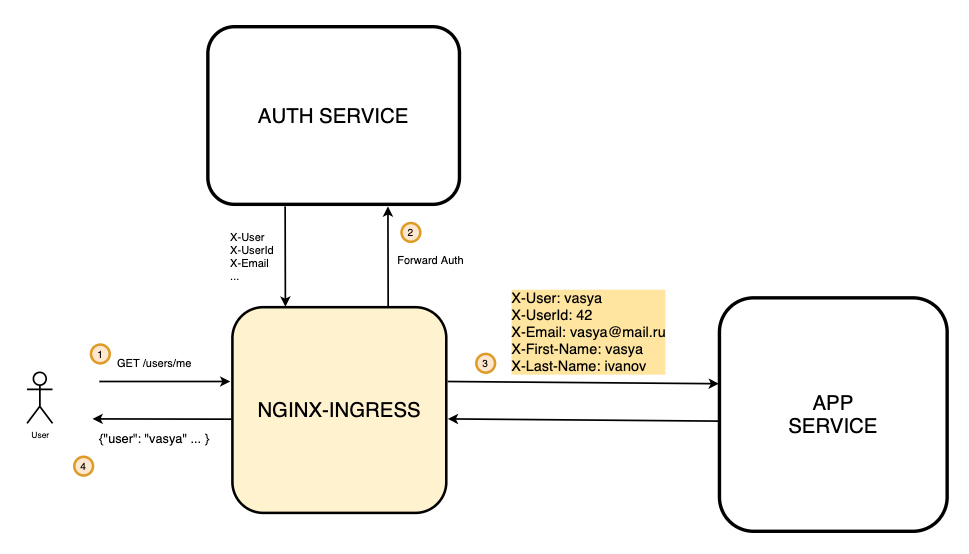

Архитектура решения




В начале убедиться, что nginx ingress запущен

```
➜  minikube addons  enable ingress
🌟  The 'ingress' addon is enabled
```

Создаем и делаем дефолтным неймспейс auth
```
kubectl create ns auth
kubectl config set-context --current --namespace=auth
```

Собираем и запускаем с помощью skaffold

```bash
➜ skaffold dev
Generating tags...
 - auth -> auth:latest
 - app -> app:latest
Checking cache...
 - auth: Not found. Building
 - app: Not found. Building
Tags used in deployment:
 - auth -> auth:0ae4ae4d64d0ea0d1dfbe1ed60d10b05e9a44e92de2550037df54160270935b4
 - app -> app:c23fc31cbaf8dbaddfa472f0677a4b43416dc533aae930d8c66ea11d817d7d16
Starting deploy...
```

Применяем ингресс для сервиса аутентификации и приложения
```bash
➜ kubectl apply -f auth-ingress.yaml -f app-ingress.yaml

ingress.networking.k8s.io/auth-proxy created
ingress.networking.k8s.io/app created
```

После настройки
Запускаем тесты с помощью newman и проверяем, что все корректно запустилось. 

```
➜  newman run postman_collection.json
newman

nginx forward auth

→ регистрация 1
  POST http://arch.homework/register [200 OK, 147B, 122ms]
  √  [INFO] Request: {
        "login": "Krystina75",
        "password": "LNW1kJ9vk05w1Gh",
        "email": "Jovan.OHara@gmail.com",
        "first_name": "Annie",
        "last_name": "Homenick"
}

  √  [INFO] Response: {
  "id": 18
}


→ логин 1
  POST http://arch.homework/login [200 OK, 236B, 20ms]
  √  [INFO] Request: {"login": "Krystina75", "password": "LNW1kJ9vk05w1Gh"}
  √  [INFO] Response: {
  "status": "ok"
}


→ проверить данные о пользователе 1
  GET http://arch.homework/auth [200 OK, 375B, 9ms]
  √  [INFO] Request: [object Object]
  √  [INFO] Response: {
  "email": "Jovan.OHara@gmail.com",
  "first_name": "Annie",
  "id": 18,
  "last_name": "Homenick",
  "login": "Krystina75"
}

  √  test token data

→ получить данные о пользователе 1
  GET http://arch.homework/users/me [200 OK, 267B, 17ms]
  √  [INFO] Request: [object Object]
  √  [INFO] Response: {
  "email": "Jovan.OHara@gmail.com",
  "first_name": "Annie",
  "id": "18",
  "last_name": "Homenick",
  "login": "Krystina75"
}

  √  test token data

→ обновить данные о пользователе 1
  PUT http://arch.homework/users/me [200 OK, 193B, 30ms]
  √  [INFO] Request: {"avatar_uri": "img1.jpg", "age": "1"}
  √  [INFO] Response: {
  "age": "1",
  "avatar_uri": "img1.jpg",
  "id": "18"
}


→ получить данные о пользователе 1 после обновления
  GET http://arch.homework/users/me [200 OK, 309B, 15ms]
  √  [INFO] Request: [object Object]
  √  [INFO] Response: {
  "age": 1,
  "avatar_uri": "img1.jpg",
  "email": "Jovan.OHara@gmail.com",
  "first_name": "Annie",
  "id": "18",
  "last_name": "Homenick",
  "login": "Krystina75"
}

  √  test token data

→ логаут 1
  GET http://arch.homework/logout [200 OK, 225B, 19ms]
  √  [INFO] Request: [object Object]
  √  [INFO] Response: {
  "status": "ok"
}


→ получить данные после разлогина 1
  GET http://arch.homework/users/me [200 OK, 197B, 15ms]
  √  [INFO] Request: [object Object]
  √  [INFO] Response: {
  "message": "Please go to login and provide Login/Password"
}


→ регистрация 2
  POST http://arch.homework/register [200 OK, 147B, 56ms]
  √  [INFO] Request: {
        "login": "Sydni57",
        "password": "U9f964ihzYIQBko",
        "email": "Neha_Jacobi@hotmail.com",
        "first_name": "Jimmy",
        "last_name": "Grant"
}

  √  [INFO] Response: {
  "id": 19
}


→ логин 2
  POST http://arch.homework/login [200 OK, 236B, 15ms]
  √  [INFO] Request: {"login": "Sydni57", "password": "U9f964ihzYIQBko"}
  √  [INFO] Response: {
  "status": "ok"
}


→ проверить данные о пользователе 1
  GET http://arch.homework/auth [200 OK, 367B, 9ms]
  √  [INFO] Request: [object Object]
  √  [INFO] Response: {
  "email": "Neha_Jacobi@hotmail.com",
  "first_name": "Jimmy",
  "id": 19,
  "last_name": "Grant",
  "login": "Sydni57"
}

  √  test token data

→ логаут 2
  GET http://arch.homework/logout [200 OK, 225B, 11ms]
  √  [INFO] Request: [object Object]
  √  [INFO] Response: {
  "status": "ok"
}


→ получить данные после разлогина 2
  GET http://arch.homework/users/me [200 OK, 197B, 24ms]
  √  [INFO] Request: [object Object]
  √  [INFO] Response: {
  "message": "Please go to login and provide Login/Password"
}


┌─────────────────────────┬───────────────────┬──────────────────┐
│                         │          executed │           failed │
├─────────────────────────┼───────────────────┼──────────────────┤
│              iterations │                 1 │                0 │
├─────────────────────────┼───────────────────┼──────────────────┤
│                requests │                13 │                0 │
├─────────────────────────┼───────────────────┼──────────────────┤
│            test-scripts │                21 │                0 │
├─────────────────────────┼───────────────────┼──────────────────┤
│      prerequest-scripts │                15 │                0 │
├─────────────────────────┼───────────────────┼──────────────────┤
│              assertions │                30 │                0 │
├─────────────────────────┴───────────────────┴──────────────────┤
│ total run duration: 1538ms                                     │
├────────────────────────────────────────────────────────────────┤
│ total data received: 875B (approx)                             │
├────────────────────────────────────────────────────────────────┤
│ average response time: 27ms [min: 9ms, max: 122ms, s.d.: 29ms] │
└────────────────────────────────────────────────────────────────┘
```
