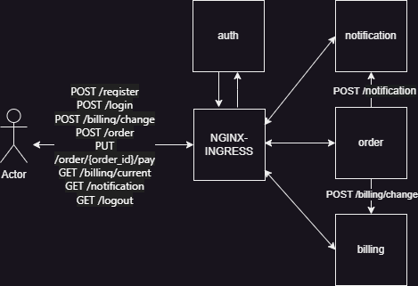

Архитектура решения

только HTTP взаимодействие



В начале убедиться, что nginx ingress запущен

```
➜  minikube addons enable ingress
🌟  The 'ingress' addon is enabled
```

Создаем и делаем дефолтным неймспейс order
```
kubectl create ns order
kubectl config set-context --current --namespace=order
```

```bash
➜ skaffold dev
Generating tags...
 - auth -> auth:latest
 - notification -> notification:latest
 - billing -> billing:latest
 - order -> order:latest
Checking cache...
 - auth: Found Locally
 - notification: Found Locally
 - billing: Found Locally
 - order: Found Locally
Tags used in deployment:
 - auth -> auth:631efb464f751362f753ff7a1073b131cd96c3bafd6ef831668f4eb5fa440eb4
 - notification -> notification:36663465f459877ff129d070005ac01bbd3c7f1c23f4f41285ef4ed9881e873b
 - billing -> billing:4bf439e7a1a27623189c532dcc7ba7bec0fc01bae231ade6a66365301c15d759
 - order -> order:16821a1589d9df93c0234f52da0180b65f5fbf5fd548765515f19d4fb74edbc2
Starting deploy...
```

Применяем ингресс для сервиса аутентификации и приложения
```bash
➜ kubectl apply -f auth-ingress.yaml -f notification-ingress.yaml -f billing-ingress.yaml -f order-ingress.yaml

ingress.networking.k8s.io/auth-proxy created
ingress.networking.k8s.io/notification created
ingress.networking.k8s.io/billing created
ingress.networking.k8s.io/order created
```

После настройки
Запускаем тесты с помощью newman и проверяем, что все корректно запустилось. 

```
➜  newman run order.postman_collection.json
newman

order

□ Тесты по ДЗ
└ регистрация
  POST http://arch.homework/register [200 OK, 146B, 108ms]

└ логин
  POST http://arch.homework/login [200 OK, 236B, 27ms]

└ пополнить счет 5000
  POST http://arch.homework/billing/change [200 OK, 236B, 89ms]
  √  test amount 5000 OK

└ Заказ на 3000
  POST http://arch.homework/order [200 OK, 262B, 66ms]
  √  Status code is 200

└ Оплатить заказ 1 ОК
  PUT http://arch.homework/order/1/pay [200 OK, 347B, 100ms]
  √  test billing status OK

└ Посмотреть деньги 1
  GET http://arch.homework/billing/current [200 OK, 156B, 45ms]
  √  test balance 2000.0

└ Посмотреть нотификации 1
  GET http://arch.homework/notification [200 OK, 261B, 16ms]
  √  test order #1 Processing

└ Заказ на 3000
  POST http://arch.homework/order [200 OK, 262B, 20ms]
  √  Status code is 200

└ Оплатить заказ 2 ERROR
  PUT http://arch.homework/order/2/pay [200 OK, 303B, 64ms]
  √  test billing status ERROR

└ Посмотреть деньги 2
  GET http://arch.homework/billing/current [200 OK, 156B, 38ms]
  √  test balance 2000.0

└ Посмотреть нотификации 2
  GET http://arch.homework/notification [200 OK, 383B, 15ms]
  √  test order #2 Failed

└ логаут
  GET http://arch.homework/logout [200 OK, 225B, 10ms]

┌─────────────────────────┬───────────────────┬───────────────────┐
│                         │          executed │            failed │
├─────────────────────────┼───────────────────┼───────────────────┤
│              iterations │                 1 │                 0 │
├─────────────────────────┼───────────────────┼───────────────────┤
│                requests │                12 │                 0 │
├─────────────────────────┼───────────────────┼───────────────────┤
│            test-scripts │                23 │                 0 │
├─────────────────────────┼───────────────────┼───────────────────┤
│      prerequest-scripts │                13 │                 0 │
├─────────────────────────┼───────────────────┼───────────────────┤
│              assertions │                 9 │                 0 │
├─────────────────────────┴───────────────────┴───────────────────┤
│ total run duration: 1793ms                                      │
├─────────────────────────────────────────────────────────────────┤
│ total data received: 1.23kB (approx)                            │
├─────────────────────────────────────────────────────────────────┤
│ average response time: 49ms [min: 10ms, max: 108ms, s.d.: 33ms] │
└─────────────────────────────────────────────────────────────────┘

```