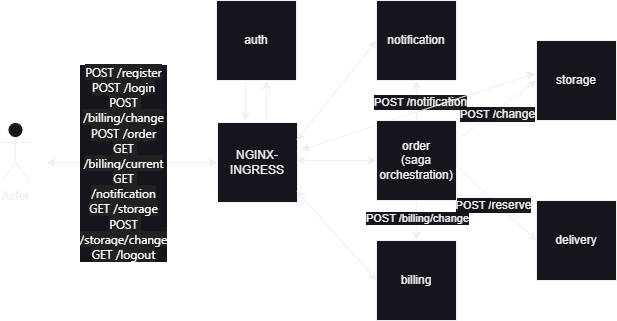

Архитектура решения

- только HTTP взаимодействие
- order реализует saga orchestration



В начале убедиться, что nginx ingress запущен

```
➜  minikube addons enable ingress
🌟  The 'ingress' addon is enabled
```

Создаем и делаем дефолтным неймспейс order
```
kubectl create ns order
kubectl config set-context --current --namespace=order
```

```bash
➜ skaffold dev
Generating tags...
 - auth -> auth:latest
 - notification -> notification:latest
 - billing -> billing:latest
 - order -> order:latest
 - delivery -> delivery:latest
 - storage -> storage:latest
Checking cache...
 - auth: Found Locally
 - notification: Found Locally
 - billing: Found Locally
 - order: Found Locally
 - delivery: Found Locally
 - storage: Found Locally
Tags used in deployment:
 - auth -> auth:631efb464f751362f753ff7a1073b131cd96c3bafd6ef831668f4eb5fa440eb4
 - notification -> notification:36663465f459877ff129d070005ac01bbd3c7f1c23f4f41285ef4ed9881e873b
 - billing -> billing:4bf439e7a1a27623189c532dcc7ba7bec0fc01bae231ade6a66365301c15d759
 - order -> order:16821a1589d9df93c0234f52da0180b65f5fbf5fd548765515f19d4fb74edbc2
 - delivery -> delivery:66f0a658dd7a747082b1ba9e12ae941c86f185d5f129771f4e636956ba98d2b3
 - storage -> storage:00d95c65ad9c725b5726bc76dc4883dfd8ee52dacca4dd61d8ab34db23652148
Starting deploy...
```

Применяем ингресс для сервиса аутентификации и приложения
```bash
➜ kubectl apply -f auth-ingress.yaml -f notification-ingress.yaml -f billing-ingress.yaml -f order-ingress.yaml -f delivery-ingress.yaml -f storage-ingress.yaml

ingress.networking.k8s.io/auth-proxy created
ingress.networking.k8s.io/notification created
ingress.networking.k8s.io/billing created
ingress.networking.k8s.io/order created
ingress.networking.k8s.io/delivery created
ingress.networking.k8s.io/storage created
```

После настройки
Запускаем тесты с помощью newman и проверяем, что все корректно запустилось. 

```
➜  newman run order.postman_collection.json
newman

order

→ регистрация
  POST http://arch.homework/register [200 OK, 147B, 160ms]

→ логин
  POST http://arch.homework/login [200 OK, 236B, 22ms]

→ Список доставщиков
  GET http://arch.homework/delivery/person [200 OK, 676B, 24ms]

→ пополнить счет 5000
  POST http://arch.homework/billing/change [200 OK, 237B, 55ms]
  √  test amount 5000 OK

→ Посмотреть деньги 1
  GET http://arch.homework/billing/current [200 OK, 156B, 57ms]
  √  test balance 5000.0

→ Пополнить склад
  POST http://arch.homework/storage/change [200 OK, 1kB, 70ms]

→ Склад актуал
  GET http://arch.homework/storage [200 OK, 708B, 17ms]

→ Резерв доставщик
  POST http://arch.homework/delivery/reserve [200 OK, 260B, 16ms]

→ Заказ на 2000 1
  POST http://arch.homework/order [200 OK, 1.63kB, 524ms]

→ Заказ на 500 2
  POST http://arch.homework/order [200 OK, 1.63kB, 275ms]

→ Заказ на 500 3
  POST http://arch.homework/order [200 OK, 1.63kB, 285ms]

→ Заказ на 500 4
  POST http://arch.homework/order [200 OK, 470B, 278ms]
  √  Нет доставщиков OK

→ Посмотреть нотификации 1
  GET http://arch.homework/notification [200 OK, 552B, 22ms]
  √  test order Processing

→ Список заказов
  GET http://arch.homework/order [200 OK, 1.28kB, 152ms]
  √  test order Failed

→ Посмотреть деньги 2
  GET http://arch.homework/billing/current [200 OK, 156B, 25ms]
  √  test balance 2000.0

┌─────────────────────────┬────────────────────┬────────────────────┐
│                         │           executed │             failed │
├─────────────────────────┼────────────────────┼────────────────────┤
│              iterations │                  1 │                  0 │
├─────────────────────────┼────────────────────┼────────────────────┤
│                requests │                 15 │                  0 │
├─────────────────────────┼────────────────────┼────────────────────┤
│            test-scripts │                 23 │                  0 │
├─────────────────────────┼────────────────────┼────────────────────┤
│      prerequest-scripts │                 17 │                  0 │
├─────────────────────────┼────────────────────┼────────────────────┤
│              assertions │                  6 │                  0 │
├─────────────────────────┴────────────────────┴────────────────────┤
│ total run duration: 4.3s                                          │
├───────────────────────────────────────────────────────────────────┤
│ total data received: 8.7kB (approx)                               │
├───────────────────────────────────────────────────────────────────┤
│ average response time: 132ms [min: 16ms, max: 524ms, s.d.: 143ms] │
└───────────────────────────────────────────────────────────────────┘

```